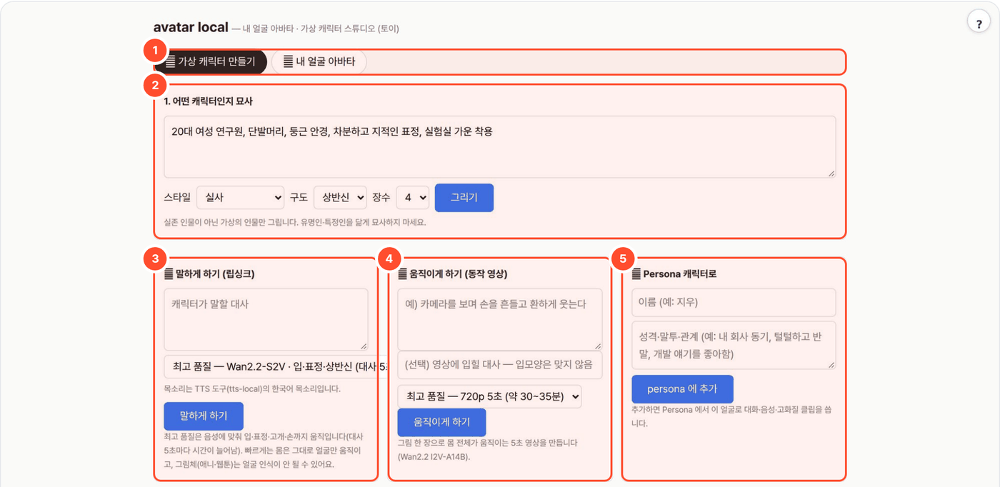

# avatar-local — 가상 캐릭터 스튜디오 · 내 얼굴 아바타 (토이)

> **한 줄 요약** — 외모·복장을 말로 묘사하면 가상 캐릭터 그림을 만들고, 고른 그림으로 말하는 영상·움직이는 영상을 만드는 토이입니다. 본인 사진 한 장과 대사로 내 얼굴이 말하는 짧은 영상도 만듭니다.
> 목소리는 TTS 도구(tts-local, MeloTTS, MIT)만 씁니다 — **목소리 복제 기능은 없습니다**(2026-10-06 라이선스 검토로 F5-TTS 제거). 전부 로컬.



## 무엇을 하나
- **그림**: 외모·복장·스타일·구도를 적으면 Qwen-Image-2512 로 가상 캐릭터 후보를 그립니다.
- **말하기**: 고른 그림과 대사로 립싱크 영상(최고 품질 Wan2.2-S2V, 빠르게 SadTalker). 목소리는 tts-local.
- **움직이기**: 동작 설명으로 5초 영상(Wan2.2-I2V-A14B).
- **내 얼굴 아바타**: 본인(또는 명시적으로 동의한 사람) 사진 + 대사 → SadTalker 립싱크 영상.

## 사용 방법
번호는 위 화면의 번호 상자와 같습니다.

1. **모드 전환**(①) — **가상 캐릭터 만들기** 또는 **내 얼굴 아바타**(사진 입력)를 고릅니다.
2. **캐릭터 설명**(②) — 외모·복장을 적고 스타일·구도·장수를 골라 **그리기**. 후보 중 마음에 드는 그림을 클릭합니다. 실존 인물·유명인을 닮게 묘사하지 마세요.
3. **말하기**(③) — 대사와 품질을 골라 영상을 요청합니다. 음성에는 tts-local 이 켜져 있어야 합니다.
4. **움직이기**(④) — 동작을 설명해 5초 영상을 요청합니다. 대사를 쓰면 음성을 입히지만 입모양은 맞지 않습니다.
5. **Persona 등록**(⑤) — 그림과 성격을 persona-local 대화 캐릭터로 추가합니다. persona-local 이 포털 목록에서 숨김 상태라 **지금은 이 칸을 화면에서 숨겨 두었습니다**(`ui.html` 의 `hidden` 을 지우면 다시 보임).

## 예시
기존 실행 결과(2026-10-06, `_data/avatar-local/2026-10-06-193d/`):

- 입력: `GPU 시험용: 안경 쓴 연구원, 밝은 배경` · 스타일 실사 · 구도 상반신 · 후보 1장
- 출력: `cand_0.png`(1104×1472) — 아래 그림(축소). AI 로 생성한 가상 인물이며 실존 인물이 아닙니다.


위 화면 캡처의 "20대 여성 연구원…" 문구는 입력 화면 시연이며 이 결과의 입력과 다릅니다. 이 예시는 그림 생성만 확인한 것이고 영상 생성·Persona 등록 결과는 아닙니다.

## 규칙 (README·UI 동의 체크 공통)
- **본인 얼굴, 또는 명시적으로 동의한 사람의 것만** 씁니다.
- 타인 영상에 얼굴을 바꿔 끼우는 기능(face swap)은 **없고, 넣지 않습니다**. 동의 없는 타인 합성은 성폭력처벌법(딥페이크)·초상권 위반입니다.
- 결과물 외부 배포 금지. 데이터는 `_workspace/`(또는 `WORKSPACE`)에만 남습니다.

## 실행
```bash
bash setup.sh                     # venv + SadTalker + 가중치(1GB) + Wan2.2 코드 → http://localhost:8777 (tts-local 을 켜 두세요)
python3 app.py --cli photo.jpg "대사" -o out.mp4
```
| env | 기본 | 설명 |
|---|---|---|
| `PORT` | 8777 | 포털 등록 포트도 8777 (`/t/avatar-local/`) |
| `LLM_API` / `LLM_BASE_URL` / `LLM_MODEL` | ollama / :11434 / qwen3:8b | 묘사 → 그림·움직이기 영상 프롬프트(영문) 작성. 포털이 띄울 때는 로컬 Ollama `:11436` + `gemma4:31b` |
| `DEVICE` | cpu | `cuda` 권장. SadTalker 는 mps 미지원 → 맥은 cpu(256px 10초 영상에 수 분) |
| GPU 고르기 | 자동 | 고정 번호 없음(`gpu_pick.py`): 립싱크는 실행마다, 스튜디오 그림(Qwen-Image-2512 약 60GB)·영상(Wan2.2 I2V-A14B 약 48GB, CPU offload)은 모델을 올릴 때마다, 말하기(Wan2.2-S2V 약 60GB)는 실행마다 여유 메모리가 가장 큰 GPU. `GPU_POOL=2,3` 후보 제한, `GPU_IDLE_UNLOAD_S`(600) 동안 안 쓰면 스튜디오 모델을 내림, `STUDIO_DEVICE=cuda:1` 이면 고정 |
| `TTS_BASE_URL` | http://127.0.0.1:8771/v1 | 목소리 — OpenAI 호환 TTS 서버(tts-local). 유일한 목소리 경로라 꺼져 있으면 "TTS 도구(tts-local)를 켜 주세요" 오류 |
| `TTS_VOICE` / `TTS_MODEL` | KR / melo | tts-local 목소리(지금은 KR 하나) |
| `WORKSPACE` | ./_workspace | 결과 폴더 |

## 흐름
사진 + 대사 → TTS 도구(tts-local) wav → SadTalker(still, crop, 256) → mp4.

## 가상 캐릭터 스튜디오 — 모델·품질·시간 (2026-10-06, H100 NVL 96GB 1장 실측)
| 단계 | 최고 품질 (기본) | 빠르게 |
|---|---|---|
| 그림 | [Qwen-Image-2512](https://huggingface.co/Qwen/Qwen-Image-2512) 50단계, 장당 약 40초 (처음 로드 +20초), VRAM 약 60GB | — |
| 말하기 | [Wan2.2-S2V-14B](https://huggingface.co/Wan-AI/Wan2.2-S2V-14B) — 음성에 맞춰 입·표정·고개·손(상반신)까지. 5초 조각마다 약 23~25분(40단계), VRAM 최고 약 60GB | SadTalker — 얼굴만, 수십 초 |
| 움직이기 | [Wan2.2-I2V-A14B](https://huggingface.co/Wan-AI/Wan2.2-I2V-A14B-Diffusers) 720p급(상반신 816×1104) 81프레임(16fps, 5초) 40단계, 약 32분 | 같은 모델 480p급(상반신 544×720) 30단계, 약 7분, VRAM 약 31GB |

- 말하기 최고 품질은 diffusers 에 아직 파이프라인이 없어 공식 코드([Wan-Video/Wan2.2](https://github.com/Wan-Video/Wan2.2), `setup.sh` 의 `WAN_COMMIT` 으로 고정)를 `vendor/Wan2.2` 에 받아
  `generate.py --task s2v-14B --size 1024*704 --offload_model True --convert_model_dtype` 를 서브프로세스로 돌린다(SadTalker 와 같은 방식). 가중치는 처음 쓸 때 HF 캐시로 받는다(`S2V_CKPT` 로 폴더 지정 가능).
  공식 코드는 flash_attn 을 꼭 쓰는데 이 서버엔 nvcc 가 없어 빌드할 수 없어서, `shim/wan/flash_attn` 대역(torch SDPA)을 그 서브프로세스에만 PYTHONPATH 로 넣는다(vendor 코드는 수정하지 않음).
- 목소리는 tts-local(MeloTTS)만. S2V 는 대사 5초마다 조각(clip)을 하나씩 더 만들어 이어 붙인다 → 5초를 넘으면 시간이 두 배.
- 움직이기는 diffusers `WanImageToVideoPipeline` + `enable_model_cpu_offload` — 14B 전문가 둘(고노이즈·저노이즈)을 CPU 에 두고 쓰는 차례에만 GPU 로(화질 같음, 시간 차이 미미). 모델 카드 권장값: guidance 3.5, 40단계, 16fps.
- 그림 크기는 모델 카드 권장 비율(얼굴 1328², 상반신 1104×1472, 전신 928×1664), 영상은 그림 비율 그대로.
- 작업 프로세스는 `studio.log` 에 작업마다 `끝 — N초, GPU n 최고 X GB` 를 남긴다.

## 폐쇄망 반입
`./pack.sh cu124` → `dist-offline/avatar-local-linux-x64-cu124.tar.gz` (wheels + SadTalker·Wan2.2 소스 + 가중치 + 보조 모델 캐시 + INSTALL.md). 스튜디오 모델(HF 캐시 약 235GB: Qwen-Image-2512·Wan2.2 I2V-A14B·S2V-14B)은 따로 반입. 서버에서 `HF_HUB_OFFLINE=1 DEVICE=cuda bash setup.sh`.

## 이 맥에서 확인한 것 (PoC)
- `selftest.py` 통과(가짜 TTS·립싱크), `bash setup.sh` 처음부터 끝까지 통과(venv·SadTalker·가중치 988MB·서버 기동), `/api/status` 전 엔진 준비됨.
- 실제 생성은 CPU(M1 Max, mps 미지원)에서 3초 대사 영상이 30분 안에 끝나지 않아 중단 → **GPU 서버에서 확인 필요**. 전처리(얼굴 정렬)와 TTS 단계까지는 정상 통과.
- SadTalker 호환 패치 2건을 `shim/`에 둠: numpy 1.24+ `np.float` 별칭(sitecustomize), `align_img` inhomogeneous array 한 줄(patch_sadtalker.py). setup.sh 가 자동 적용.

## 한계
- 목소리는 tts-local 의 한국어 목소리 하나(내 목소리 아님). 목소리 복제는 라이선스 문제로 넣지 않는다(F5-TTS 가중치 CC-BY-NC-4.0).
- 256px 얼굴 크롭 기준 화질. 고화질(512)·보정(gfpgan)은 꺼 둠(basicsr 가 최신 torchvision 과 충돌).
- 정면·단일 얼굴 사진만. 안경·측면은 흔들림.

## 출처·감사 (Credits)

- [SadTalker](https://github.com/OpenTalker/SadTalker) (Apache-2.0) — 립싱크. setup 때 `vendor/` 로 받아 쓰며 수정하지 않음(호환 패치는 `shim/`)
- 목소리: 같은 포털의 tts-local 도구(MeloTTS, MIT)를 HTTP 로 호출 — 이 도구에 TTS 모델은 없음
- 가상 캐릭터 스튜디오 (모델은 처음 쓸 때 받고 재배포하지 않음):
  - 그림: [Qwen/Qwen-Image-2512](https://huggingface.co/Qwen/Qwen-Image-2512) (Apache-2.0) — [diffusers](https://github.com/huggingface/diffusers) (Apache-2.0) 로 실행
  - 움직이기: [Wan-AI/Wan2.2-I2V-A14B-Diffusers](https://huggingface.co/Wan-AI/Wan2.2-I2V-A14B-Diffusers) (Apache-2.0)
  - 말하기(최고 품질): [Wan-AI/Wan2.2-S2V-14B](https://huggingface.co/Wan-AI/Wan2.2-S2V-14B) (Apache-2.0) — 공식 코드 [Wan-Video/Wan2.2](https://github.com/Wan-Video/Wan2.2) (Apache-2.0) 를 `vendor/` 로 받아 수정 없이 실행
  - 말하기(빠르게): 위 SadTalker 를 그대로 유지
- face_alignment (BSD-3), facexlib (MIT), PyTorch/torchvision (BSD)
- **LLM 실행** — OpenAI 호환 API 로 호출합니다(모델 가중치는 동봉하지 않음). 기본 배포는 [Ollama](https://github.com/ollama/ollama) (MIT) 위의 Google [Gemma](https://ai.google.dev/gemma) `gemma4:31b` — 모델 이용 조건은 Gemma 배포처 참고.
- 이 도구는 [agent-page-portal](https://github.com/gggg8657/agent-page-portal) 에 연결해 쓰도록 만들었습니다(단독 실행도 됨).

저작권 표기·전체 목록은 `NOTICE` 를 보세요.
